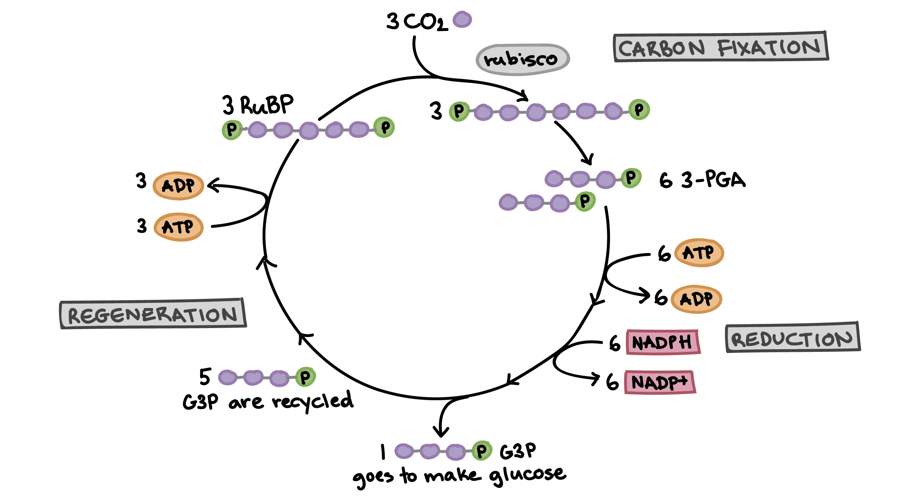

# Cellular Energetics 
S1 Final Exam Percentage: 19%
AP Exam Score Percentage: 12-16%

---

## Chapter 6 - An Introduction to Metabolism
#### Terms to know
**Energy** - Ability to do work.
**Metabolism**  - All the ractions occuring in an organisim.
**Catabolic** - A reaction to break something down.
**Anabloic** - A reaction to build something.
**Exergonic** - A reaction that relases (**exerts**) energy.
**Endergonic** - A reaction that takes **in** energy.
**Spontaneious** - A reaction that does not require energy (has a $\Delta\text{G of} \leq 0$)
**Energy Coupuling** - The coupling of an Endergonic reaction to an Exergonic reaction (the Endergonic reaction is fuled by the Exergonic reaction)

### Free Energy
Represented by the symbol $\Delta\text{G}$
Only processes with a negitive or 0 $\Delta\text{G}$ are **spontaneous**. 

### ATP 
**A**denosine **T**ri **P**hosphate
Energy is stored in the bond between the second and third phosphates

## Chapter 7 - Cellular Respiation and Fermentaion 

### Aerobic Cellular Respiration

#### Aerobic Cellular Respiration Diagram

#### Aerobic Cellular Respiration Formula

$$C_6H_{12}O_6 \;+\; 6O_2 \;+\; 2\, ATP \quad \to \quad 6CO_2 \;+\; 6H_2O \;+\; 38\,ATP$$

### Anaerobic Cellular Respiration
Uses only Glycolysis
Produces Latic Acid or Ethyl Alcohol and much less ATP

#### Anaerobic Cellular Respiration Diagram
Latic Acid:

     
Ethyl Alcohol

  OiL/RiG 

Oxidation Looses Electrons
Reduction Gains Electrons

## Chapter 8 - Photosynthesis

#### Photosythesis Diagram

### Light Reactions Diagram

### Calvin Cycle Diagram

### Photorespiration
The enzyme Rubisco cannot tell the difference between $CO_2$ and $O_2$ and therefore if the stomata is closed and the Rubisco can only use $O_2$ it will.
This will eventually kill the plant since the Cellular Respiration process will also be unable to get any $O_2$ since the stomata is closed and the rubisco has used all the $O_2$.
Photorespiration occurs in C$_3$ (Normal/Simple) plants (pictured below.)

#### Solutions to Photorespiration
CAM and C$_4$ plants have each evolved in seperate ways to beat Photorepiration in hot/dry enviroments.

| Type |  Separation of initial $\text{CO}_2$ fixation and Calvin cycle | Stomata Open | Best adapted to |
| ------ | ------------------------------------------------- | --------------- | ---------------- |
| $\text{C}_3$ | No seperation | Day | Cool, Wet enviroments |
| $C_4$ | Between mesophyll and bundle-sheath cells (in space) | Day | Hot, sunny enviroments |
| $\text{CAM}$ | Between nigh and day (in time) | Night | Very hot, dry enviroments |

##### CAM Plants
CAM Plants use temporal (time) sepertaiton in order to seperate rubisco from the rest of the plant so it is unable to use up oxygen.

#### $\text{C}_4$ Plants
$\text{C}_4$ plants use spatial sepeartion in order to sepearte rubisco from the rest of the plant. 

